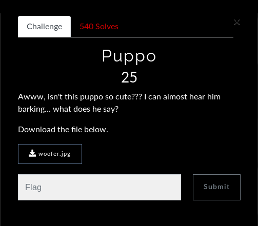
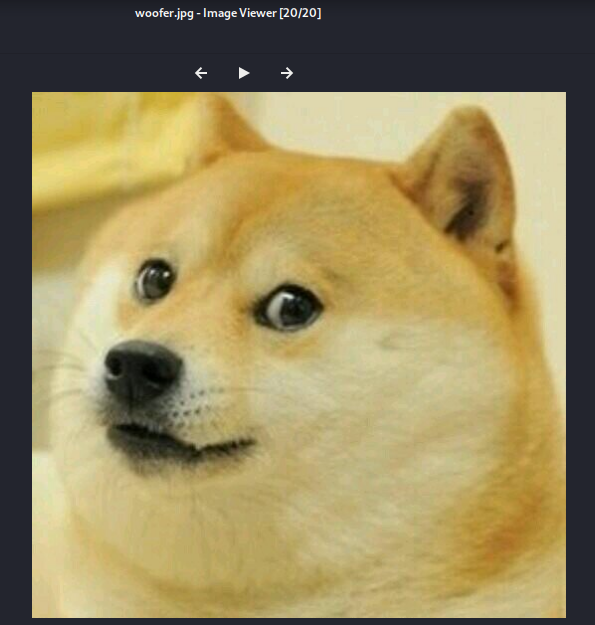

# Embedded into image

This is the challenge


This is the file to [download](woofer.jpg) in the challenge

On opening the download image, we get the dog image.



On running file over the image we see a comment added into the image at particular line number.

Then on doing research I got to know its encoded in base64, decode to get the flag


```
LLS{doggo_says_such_base64_very_wow}
```
