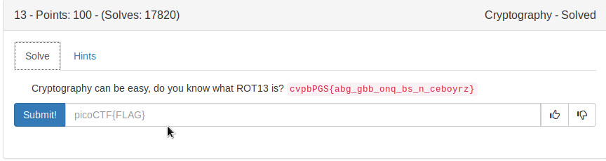
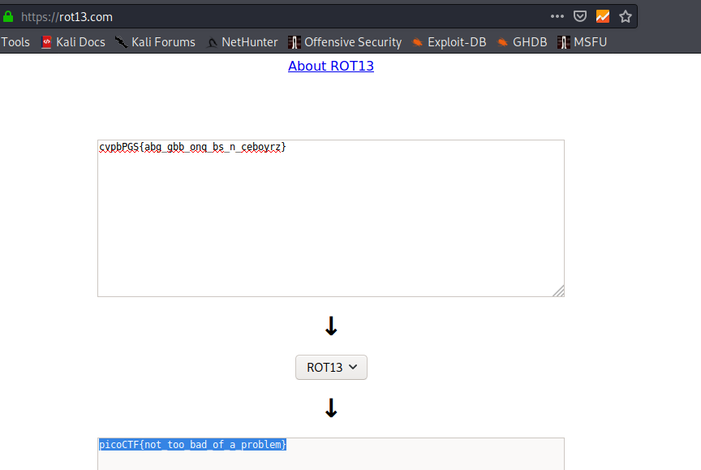

# rot13

If you look at this you will understand what rot13 is.




So you can do it by your hand or you can use online tool.

[Link](https://rot13.com/) to online rot13.



FLAG
```
picoCTF{not_too_bad_of_a_problem}
```
