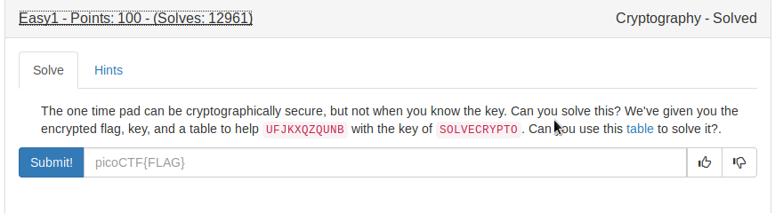
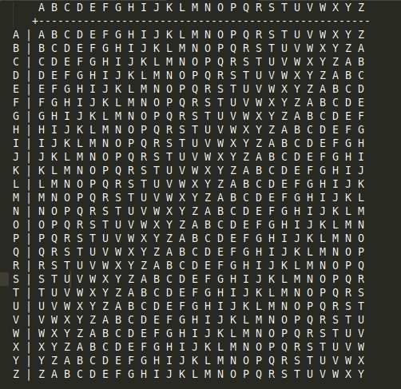

# Caesar Shift Cipher



By using this [table](table.txt) we can ecrypt 

### Theory

Row - Key

Column - Plain Text

Intersection of row,col - Cipher.

We are given with cipher and key, we need to decrypt and find the plaintext using the table.



FLAG
```
picoCTF{CRYPTOISFUN}
```
