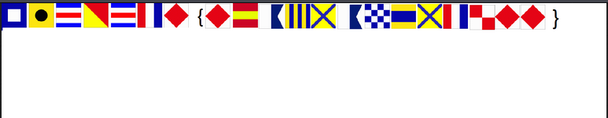

# International Maritime Signal

## Challenge

> What do the [flags](flag.png) mean?



By looking at the image we have different flags, They are actually

International Maritime Signal Flags.

These are flags are used for communication between 2 boats or between the boat and shore.

Solution

> We need to decode each of the flags. This [site](https://en.wikipedia.org/wiki/International_maritime_signal_flags) 
  can help for decoding.
 
 FLAG
 ```
PICOCTF{F1AG5AND5TUFF}
 ```
