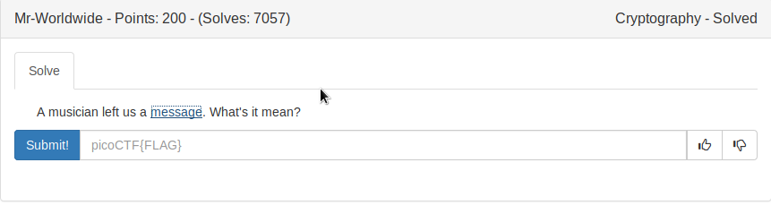

# Mr_Worldwide




By looking at this file we are able to make a wild guess, that these are (latitude,longitude) pairs.

By using the google maps, we need to decode each pair with the starting letter of the city name.


FLAG
```
picoCTF{KODIAK_ALASKA}
```
