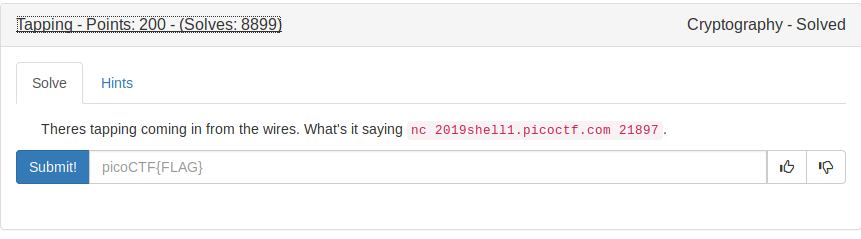
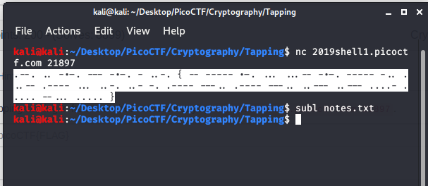

# Tapping



On looking at this



It contains dot(.) and dashes(_). So it must be a cipher.

Yes, Its MORSE CODE.

Theory about Morse Code
```
Morse code is a method used in telecommunication to encode text 

characters as standardized sequences of two different signal durations, 

called dots and dashes or dits and dahs
```

We use this online [tool](http://www.unit-conversion.info/texttools/morse-code/) to decode the morse code to get the flag.

FLAG
```
PICOCTF{M0RS3C0D31SFUN1818224575}
```
