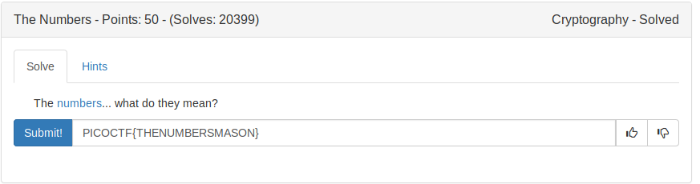
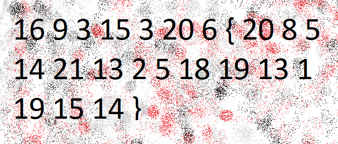

# NUMBERS TO ALPHABETS

This is a basic cipher where the english letters are encoded as numbers.
A - 1
B - 2 
.....
.....



This is the [image](the_numbers.png) given by the challenge



By using this basic [script](numbertoalpha.py) we are coverting those numbers to letters.

FLAG
```
PICOCTF{THENUMBERSMASON}
```
