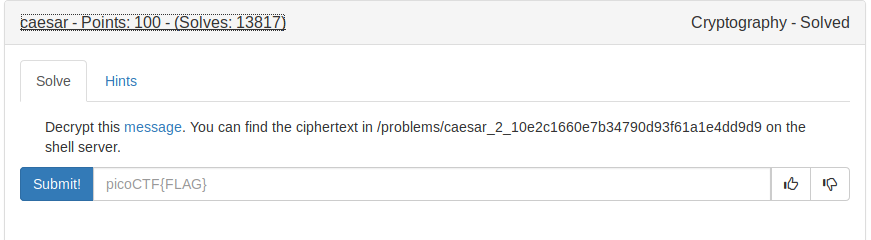

# Ceasar Cipher

This is a shift cipher, where a letter is shifted by number shifts choosen.



We are given with this text [file](images/ciphertext)

By using this [script](ceasar.py) we get the flag.

By looking at the Shift 11, we get the flag.

FLAG
```
picoCTF{crossingtherubiconvrtezsxl}
```
