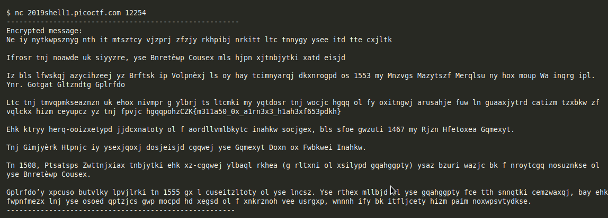

# la cifra de

Challenge

> I found this cipher in an old book. 
  Can you figure out what it says? 
  Connect with nc 2019shell1.picoctf.com 12254.
  
Hint

> There are tools that make this easy.
  Perhaps looking at history will help
  
By using the info we can make a guess as vigenere cipher.

Cipher that we are given is this.



We need to crack without using key, so we will be using online tool to crack.

Online [tool](https://www.guballa.de/vigenere-solver)

For better understanding of this challenge, you can watch this [video](https://www.youtube.com/watch?v=9Vzy4wEmjVA)

FLAG
```
picoCTF{b311a50_0r_v1gn3r3_c1ph3ra653edec}
```
