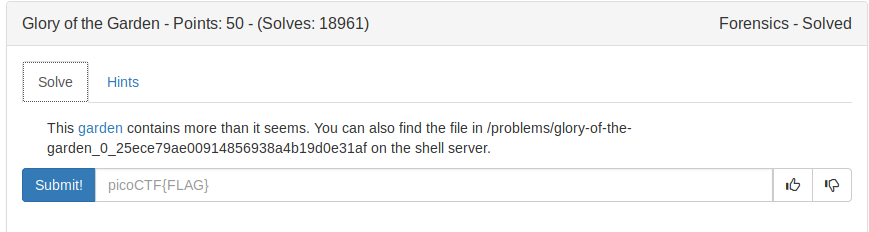
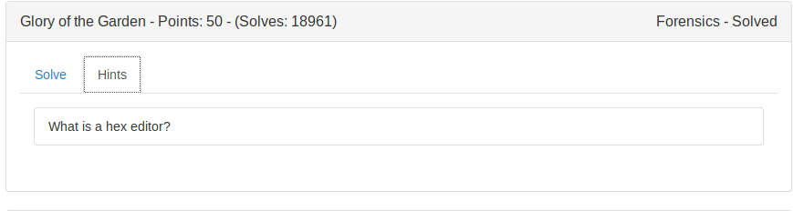
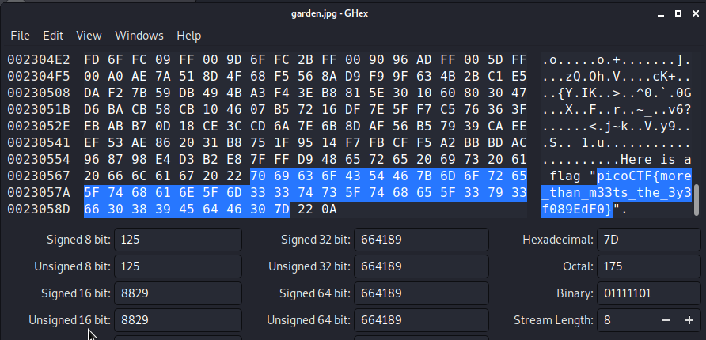

## HEX EDITOR

```
Tool which helps us to view and edit the hex data or hex dump of an image.
```

Hex editor that I will be using is, 
### ghex

HOW TO USE ?

```
$ ghex [IMAGENAME]
```

[This is the given image](garden.jpg)



FLAG:
```
 picoCTF{more_than_m33ts_the_3y3f089EdF0}
```
