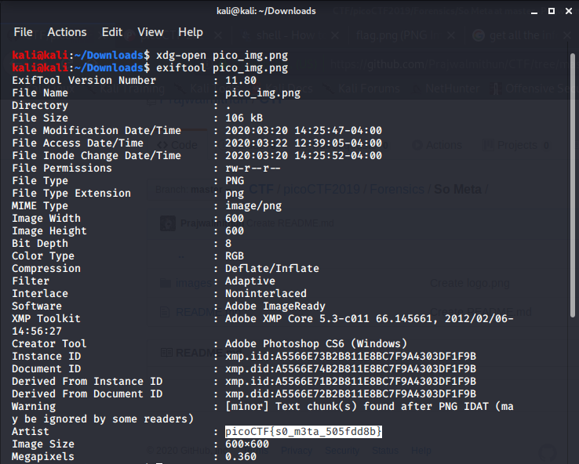

# METADATA
```
Image metadata is a text information which gives information about the details associated with the image. 

Some of these details are: + Size and resolution + The author of the image + The GPS data of this image 

+ The time when the image was taken, last modified etc.
```

To view the metadata I will be using a command line tool *exiftool*.

### Usage
```
exiftool [IMAGENAME]
```



FLAG:
```
picoCTF{s0_m3ta_505fdd8b}
```
