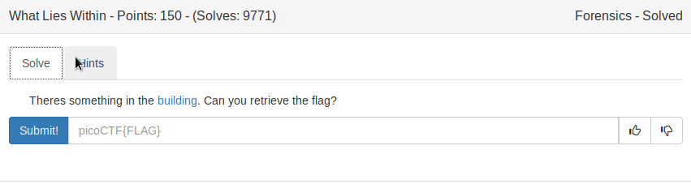
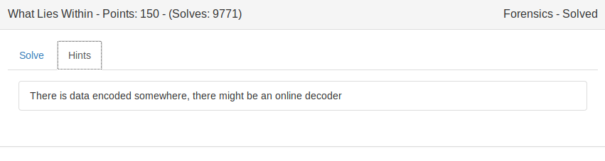
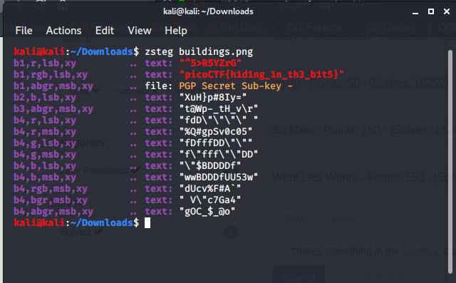

## Steganography

Hiding text,music,images etc within another image, this technique is called Steganography.

Tool used:
### zsteg
```
This tool is used to detect LSB steganography in PNG and BMP.
```
Usage:

```
zsteg [IMAGE.png]
```



FLAG:
```
picoCTF{h1d1ng_1n_th3_b1t5}
```
