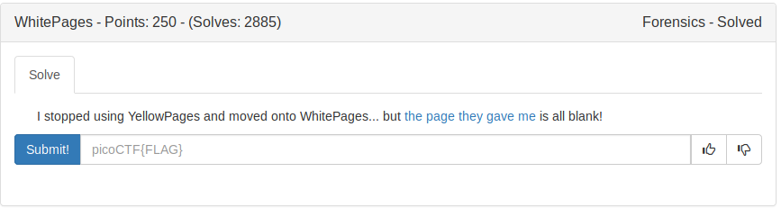
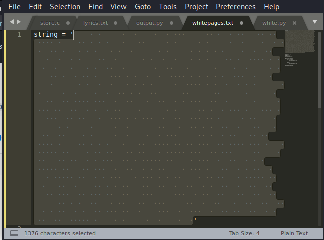
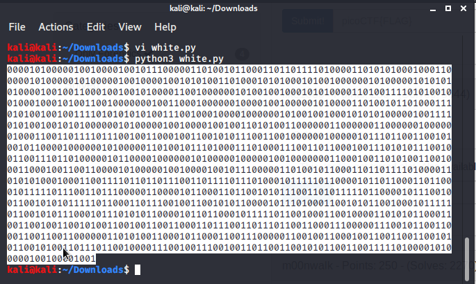

On running *file* command over the given file we get the output as:
```
```

On opening in the text editor, it looks empty.

But on selecting the entire file (CTRL+A)., observation can be made,

There are only 2 type of space,

> Single space

> Double space

So, it might be binary.

Replace Single space with *1*

Double Spaces with *0*

So I wrote a python script to do this

Then use any online binary to ascii convert to get the flag.





FLAG:
```
picoCTF{not_all_spaces_are_created_equal_dd5c2e2f77f89f3051c82bfee7d996ef}
```
