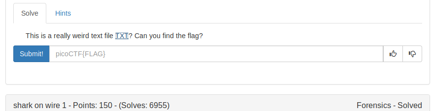
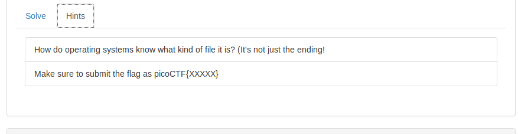
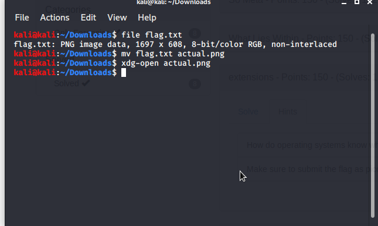
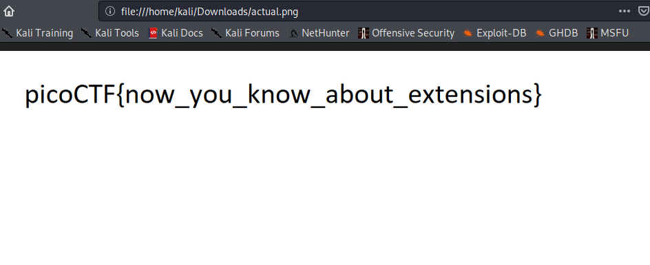

This challenge realises that the content determine not the extension.

Never believe in the extensions.

To know the type of the file command used is *file*

Usage:
```
file [FILENAME]
```




FLAG:
```
picoCTF{now_you_know_about_extensions}
```
