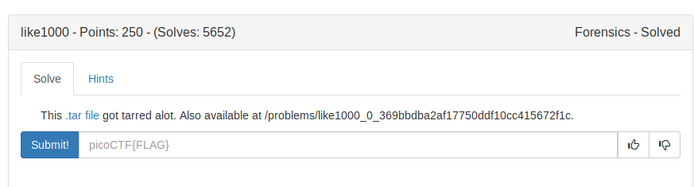
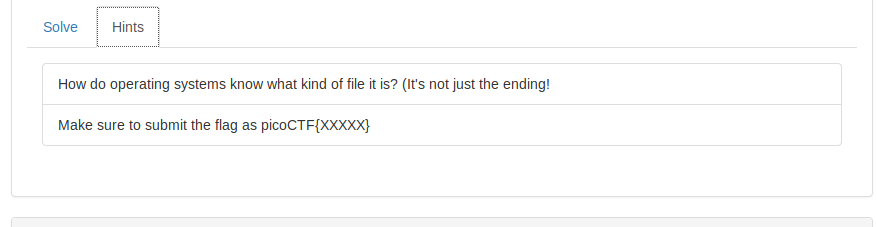
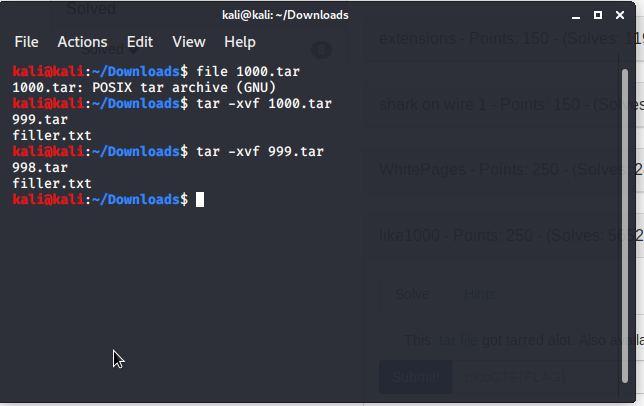

So by looking at the problem statement we can think it as its about archiving/unarchiving 

a file .

In Linux .tar is the extension of the archived flie.

Command to untar a tar file is:
```
$ tar -xvf [FILENAME]

x : extracting
v : verbose mode
f : forced extract
```



On looking at the above image it seems that, its nested tor.
```
1000.tar
    |_____ filler.txt
    |_____ 999.tar
            |_____ filler.txt
            |_____ 998.tar
                     |______
                     .
                     .
                     .
                              |_____ filler.txt
                              |_____ 1.tar
                              
```

We can automate rather than typing the command 1000 times.

So I written a [shell script](./untar.sh) to automate the task.

FLAG:
```
picoCTF{l0t5_0f_TAR5}
```
            
