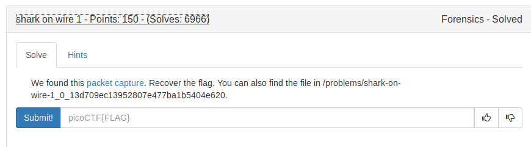
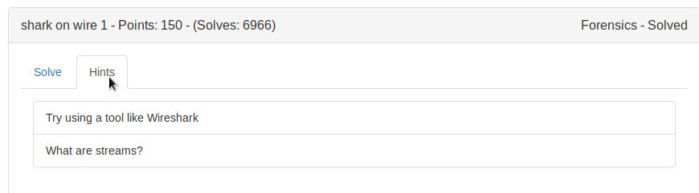
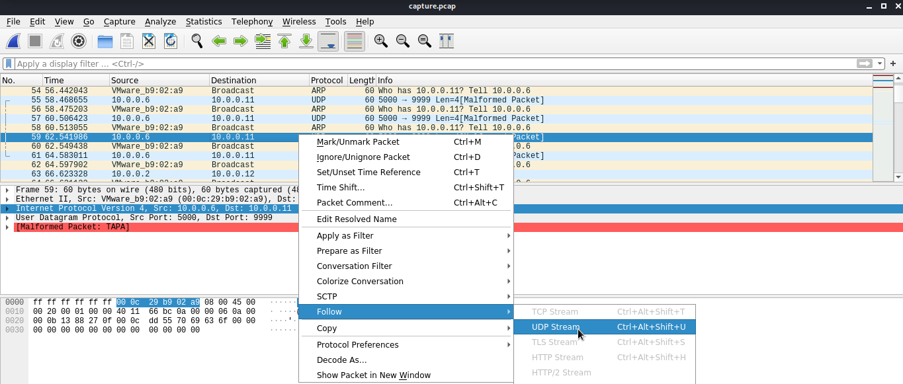
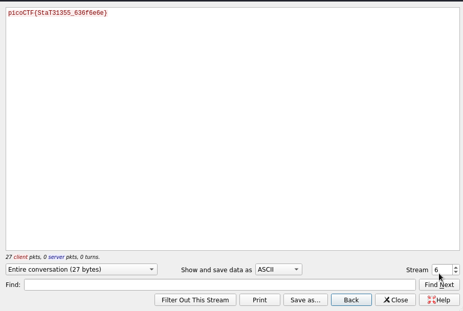

## Wireshark 

This is the tool used for analysing PCAP files.

PCAP files are the files which contains information about the network session like,

what was the data tranferred between the two hosts,etc.,

## Streams

Basically, streams are nothing but which allows the packet to move., ie TCP stream contains all the packet which follow 

TCP protocol. Likewise the HTTP, etc.

So wireshark provides this feature. *Follow stream* to narrow the packets in that specific stream.






FLAG:
```
picoCTF{StaT31355_636f6e6e}
```

