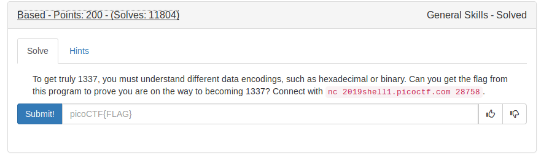
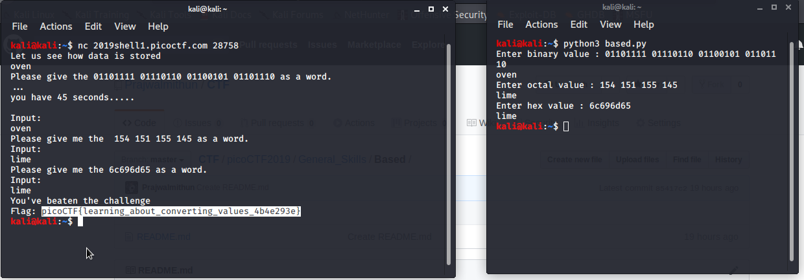

This challenge demand us to convert base2, base8, base16 to string.
So I wrote a [python script](based.py) to do this conversion.

FLAG:
```
picoCTF{learning_about_converting_values_4b4e293e}
```

