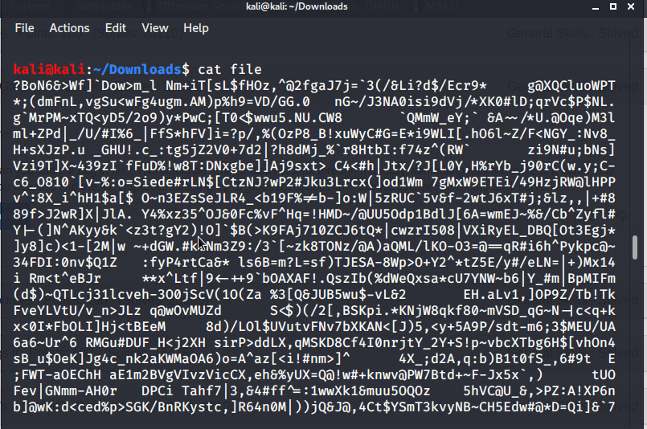

### grep

So this challenge forces to use grep command to search the flag.



On looking at the above file it's pretty much daunting and overwhelming to find the flag.
So, here is the command to make it easy for searching.
And the syntax is,
```
grep [pattern_to_match] [filename]
```


Here you can use either of the above commands to get the flag

FLAG:
```
picoCTF{grep_is_good_to_find_things_887251c6}
```

