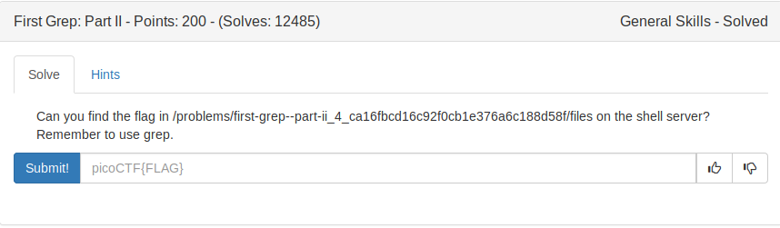
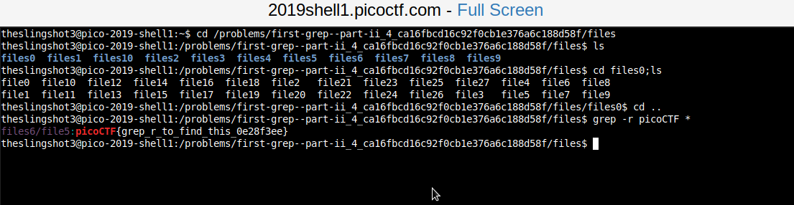

On looking at the above image we can see that we have may directories.
Each directory has many files. Our task is to find the flag which is 
present in one of the files. 

We use grep for this purpose.

```
grep -r [pattern_to_match] [directory_names]
```

-r - is used for recursive search(ie., to search all the files in specified directory).
\*  - because to search in all the directories.

FLAG:
```
picoCTF{grep_r_to_find_this_0e28f3ee}
```
