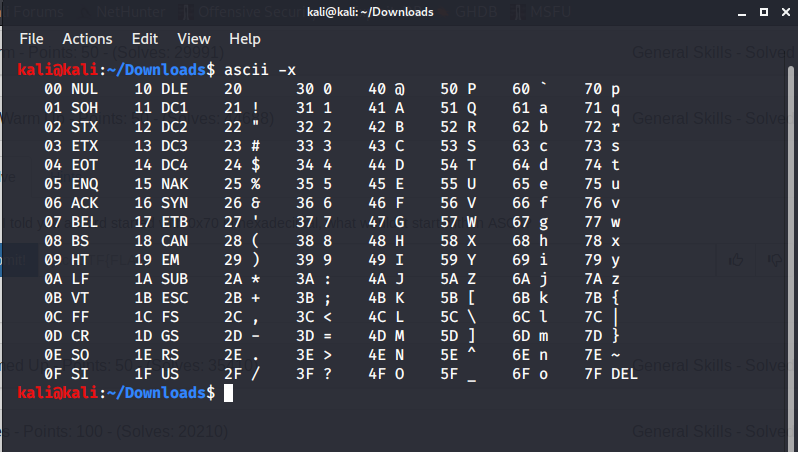

This is a simple challenge which can be solved in many ways.
But, I solved it using the command ascii

```
ascii -x 
```
-x - is used for hexadecimal table of ascii characters.

On looking at the result, the equivalent character for 0x70 is p.

FLAG:
```
picoCTF{p}
```
