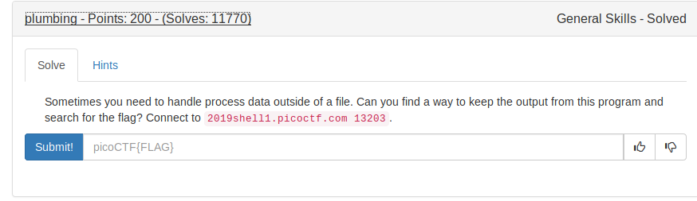
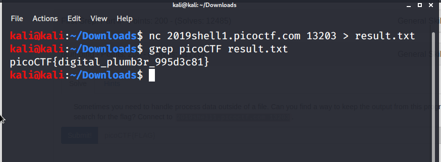

We connect to remote host with the help of netcat(nc) command.

### Format of nc
```
nc [domain_name/IP address] [port]
```

On connecting we get a huge lines of strings.So we can redirect the output to a file using
\> operator.

Then we can run grep over it to get the flag.

FLAG:
```
picoCTF{digital_plumb3r_995d3c81}
```
