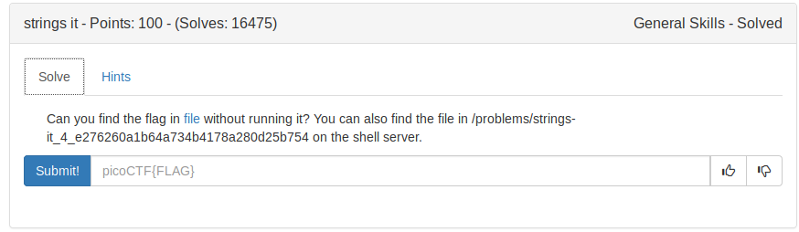
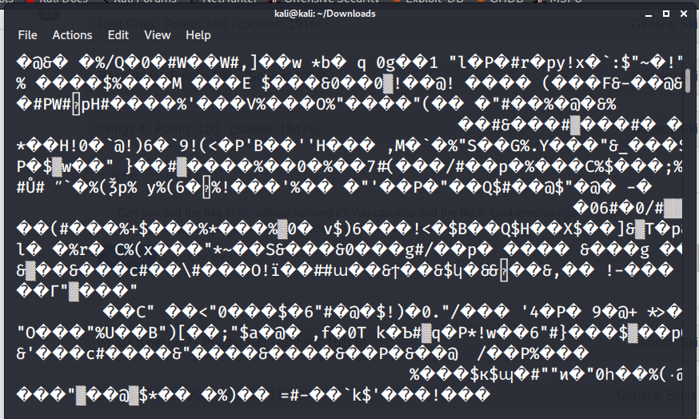
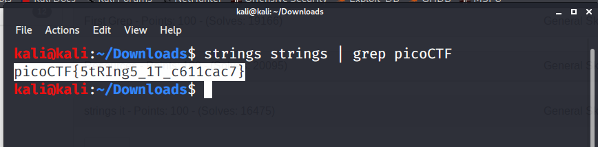

This is the file that I got after downloading from picoCTF.
On looking the above image, the file contains many unreadable (ie., unprintable) characters.

So, we use strings command to read printable characters.

Format of strings
```
strings [filename]
```



FLAG:
```
picoCTF{5tRIng5_1T_c611cac7}
```
