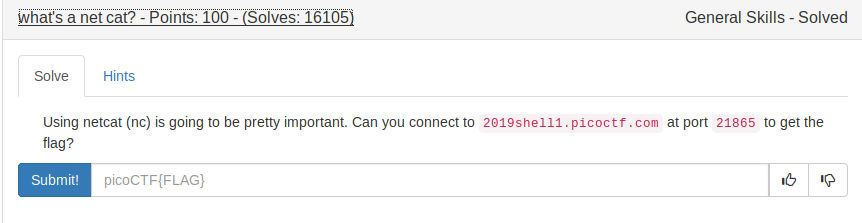
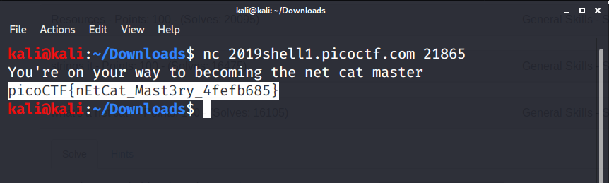

This challenge is based on the usage of Netcat tool.

NetCat is a tool which helps for reading/writing data over the network.

It can also used for port scanning, chatting, can act as client, server.

Usage:

```
nc [options] [destination] [port]

options - like -h can be used to get more info about nc.

destination - its the target's domain or IP address.

port - port on which you want to connect
```

FLAG:
```
picoCTF{nEtCat_Mast3ry_4fefb685}
```
