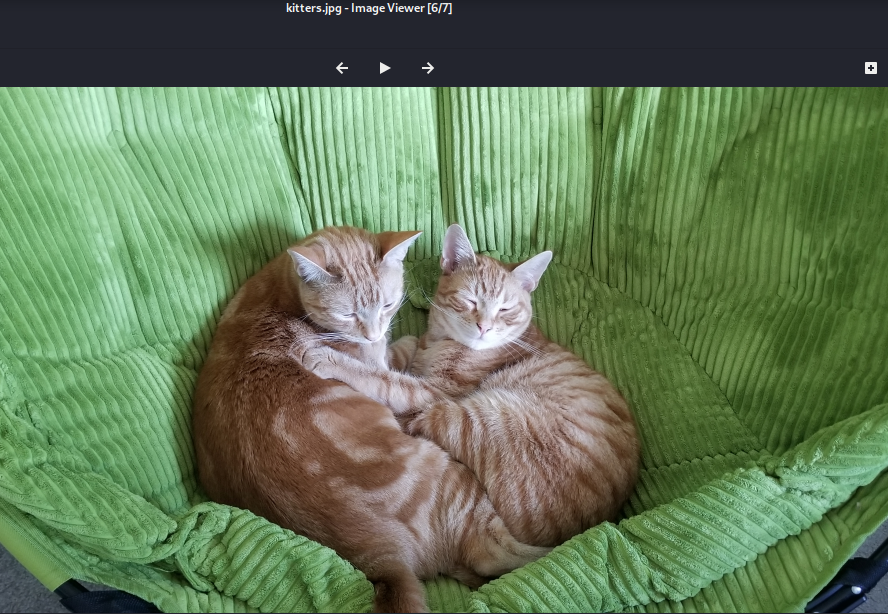
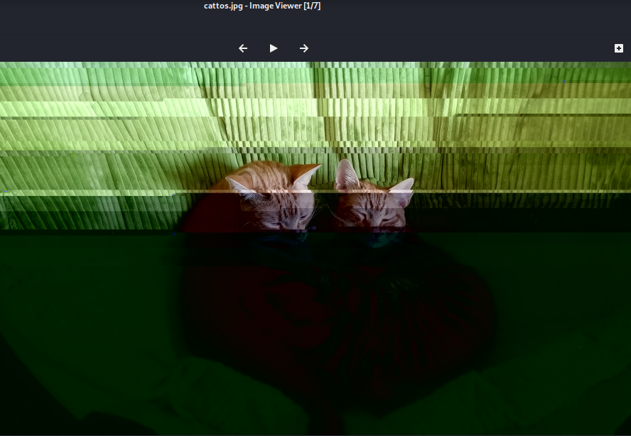

We have 2 images to compare. On looking at the 2nd image, it has been blurred/blackend.

So this difference happens byte byte in each image.


FLAG:
```
picoCTF{th3yr3_a5_d1ff3r3nt_4s_bu773r_4nd_j311y_aslkjfdsalkfslkflkjdsfdszmz10548}
```

