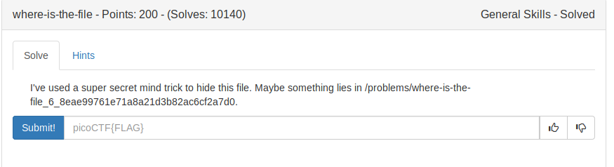
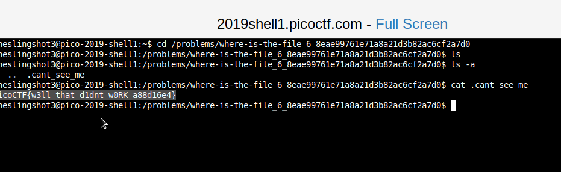

On running ls over the specified path, it happens to be no files.

But actually you can hide a file or directory in linux using the format,

```
.[folder/filename]
```

So the command to look at the hidden files is, this:



FLAG:
```
picoCTF{w3ll_that_d1dnt_w0RK_a88d16e4}
```
