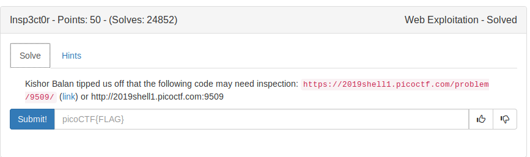
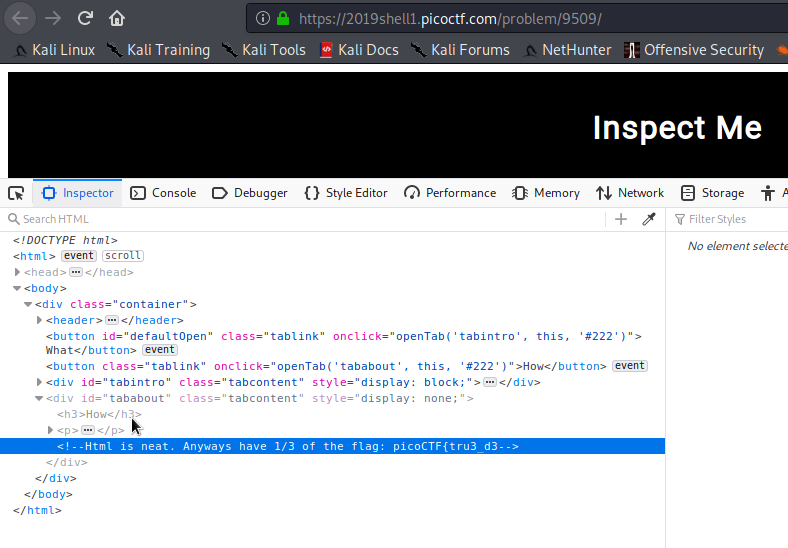
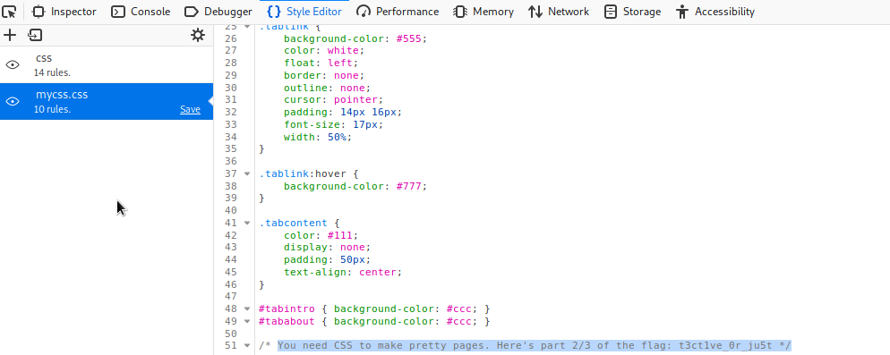
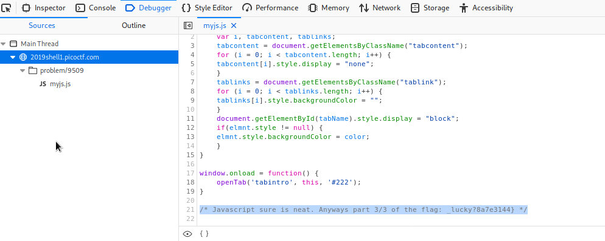

# Insp3ct0r 

## The hint is using inpect element in the browser



This challenge's flag has 3 part (you can guess HTML, CSS, JS)

## HTML file (Part 1)



## CSS file (Part 2)



## JS file (Part 3)



So on combining all the part we get the flag for this challenge.

FLAG
```
picoCTF{tru3_d3t3ct1ve_0r_just_lucky?8a7e3114}
```
