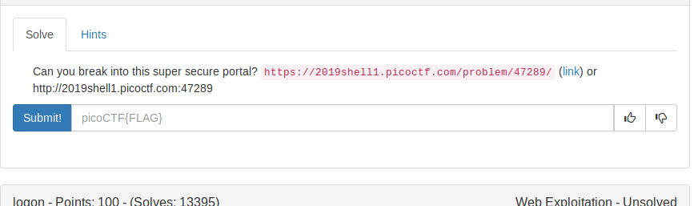
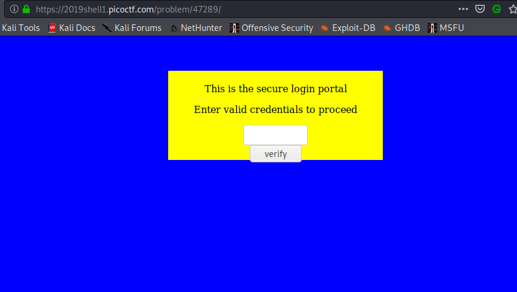
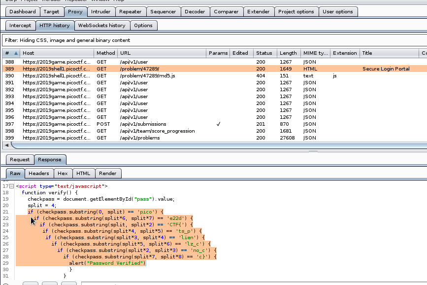

On opening the link we see this 



Theory : We can include javascript inside html with <script>.
 
On looking at the code, they are comparing the input given by the user.  

So why not decode accordingly like looking at the numbers from 0th index to last index.



FLAG
```
picoCTF{no_clients_plz_ce22dc}
```
