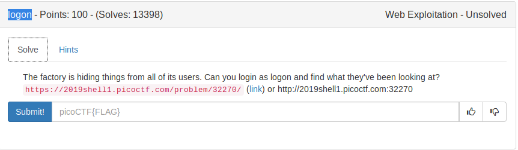
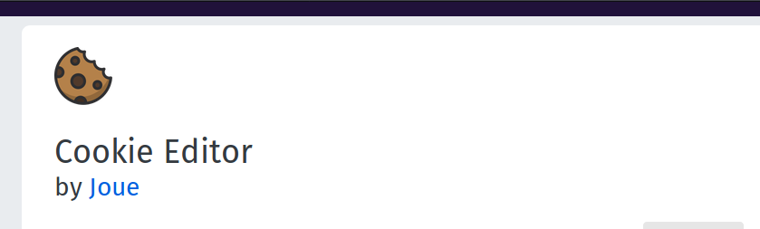
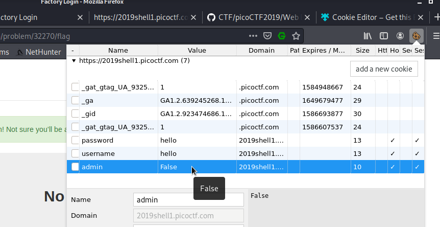
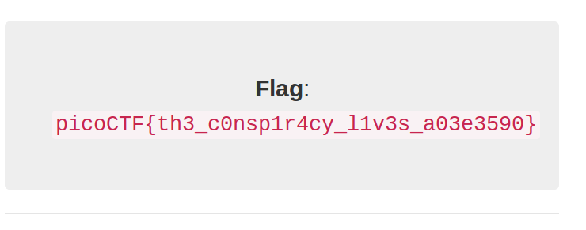

# Editing cookies

## Theory : What are cookies ?
```
An HTTP cookie is a small piece of data sent from a website 
and stored on the user's computer by the user's web browser 
while the user is browsing.
```
This is the challenge 



We need cookie editor extension 



On looking at this image we see the value of admin is False.

We edit to True to get the flag.





FLAG
```
picoCTF{th3_c0nsp1r4cy_l1v3s_a03e3590}
```
