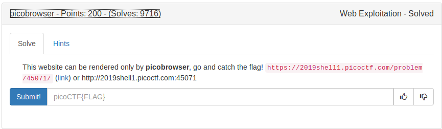
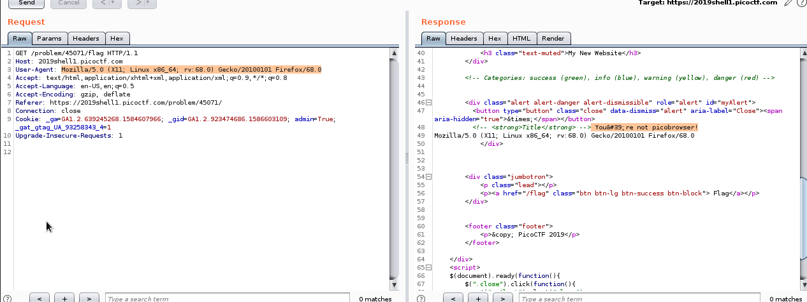
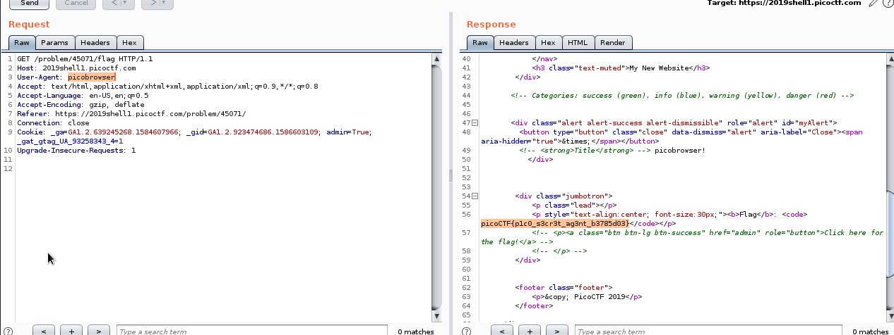
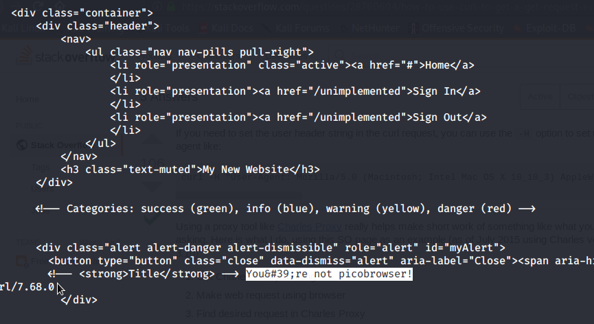
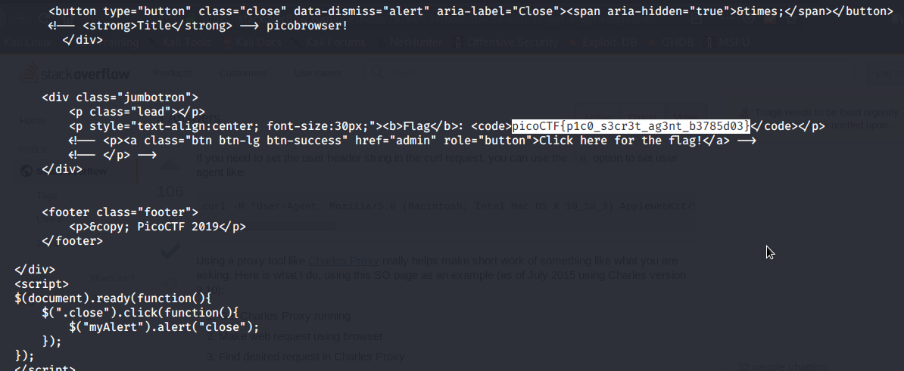

# User Agent
```
This is present in the HTTP request. This specifies from which client the
request is send. ie., from chrome or firefox or curl 
```


This agent demands the request must be sent from picobrowser.

So we need to change the value of user-agent in HTTP request.

There are 2 ways to alter the user agent.
1. Burpsuite
2. Curl (CLI)

# 1. Burpsuite

## Before editing


## After editing


# 2. curl
Normal command to request the webpage
```
curl https://2019shell1.picoctf.com/problem/45071/flag
```
Result



After changing the user-agent to picobrowser
```
curl https://2019shell1.picoctf.com/problem/45071/flag --user-agent picobrowser
```
Result



FLAG
```
picoCTF{p1c0_s3cr3t_ag3nt_b3785d03}
```


