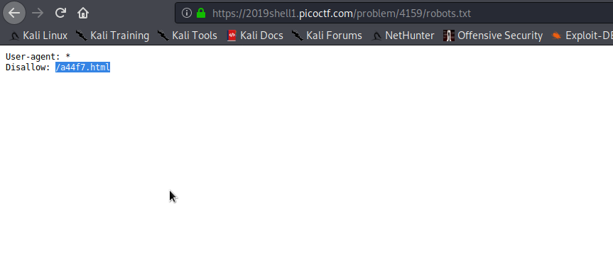
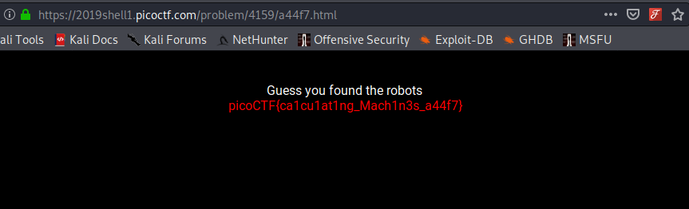

# Robots.txt 

```
 The robots.txt file is primarily used to specify 
 which parts of your website should be crawled 
 by spiders or web crawlers.
 This file is present is the home directory of the website.
 ```
 

 
 This is the challenge [website](https://2019shell1.picoctf.com/problem/4159/)
 
 On opening the robots.txt we see a html page which is disallowed.
 


On opening the disallowed page you get the flag.


FLAG
```
picoCTF{ca1cu1at1ng_Mach1n3s_a44f7}
```
 
 
